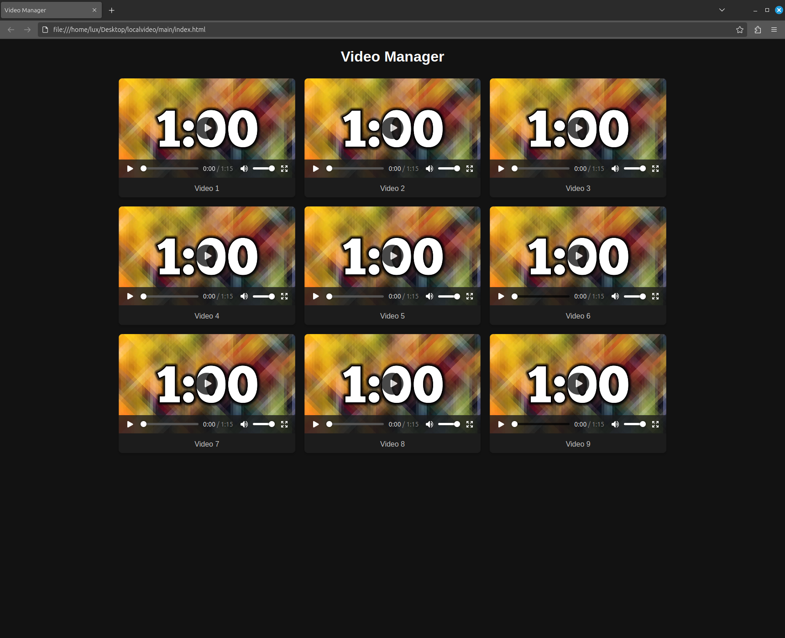

# Local-Video 🎥
##### The *idea* is to create a local video player with ``` apache 2``` and also an automated video downloader that only needs to write links to a file and automatically deletes used links from which videos have already been downloaded.
## web-site 💾
> ### The videos are placed on the site using a grid method.

## local-host server  🖥
> ### The localhost server will be running on the [```apache2```](https://httpd.apache.org/) server so that all devices on the LAN that can access the Internet can view the locally hosted content.
